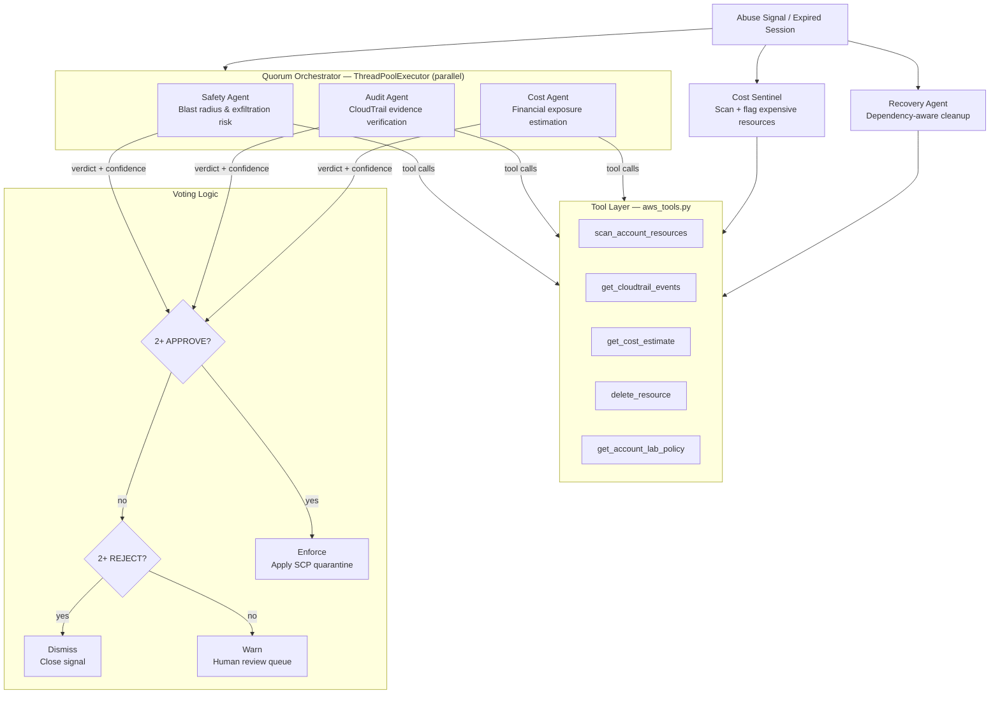

# AI Sentinel Ecosystem

Autonomous multi-agent system for AWS account governance — three Claude agents that deliberate, scan, and recover, running on the Anthropic SDK with a deterministic tool layer.


**Validated across 49 runs, 30 scenarios — 98.4% detection accuracy, zero false-positive quarantines.**


> *Portfolio extraction of work built at KodeKloud, Feb–Mar 2026. Commit timeline reflects the original development.*

---

## The Problem

Cloud lab environments get abused. Users spin up GPU instances, NAT Gateways, and ECS clusters that cost hundreds of dollars — often within minutes of getting access. Static threshold rules require constant maintenance. Manual review doesn't scale.

This system uses three AI agents with independent specializations to evaluate every suspicious event, vote on enforcement, and apply an SCP quarantine — only when 2 of 3 agents agree.

---

## System Architecture



---

## Agents

Three autonomous agents that govern AWS lab account lifecycle:

| Agent | Role | What it does |
|---|---|---|
| **Quorum Agent** | Governance | 3 specialists deliberate in parallel and vote on whether to enforce a quarantine SCP |
| **Cost Sentinel** | Detection | Scans an account for active resources, prices them, checks against lab policy, flags violations |
| **Recovery Agent** | Remediation | Cleans up orphaned accounts after session expiry — dependency-aware deletion ordering |

### Quorum Specialists

| Specialist | Focus | Enforces when... |
|---|---|---|
| **Safety Agent** | Operational risk | Resource could enable exfiltration, lateral movement, or policy scope violation |
| **Audit Agent** | CloudTrail evidence | Events match known abuse patterns (cost spikes, unusual API sequences) |
| **Cost Agent** | Financial exposure | Monthly estimate exceeds threshold (`< $20` warn · `$20–$100` flag · `> $100` quarantine) |

### Quorum Decision Table

| Safety | Audit | Cost | Decision |
|--------|-------|------|----------|
| APPROVE | APPROVE | any | **Enforce** — SCP quarantine applied |
| APPROVE | any | APPROVE | **Enforce** — SCP quarantine applied |
| any | APPROVE | APPROVE | **Enforce** — SCP quarantine applied |
| REJECT | REJECT | any | **Dismiss** — signal closed |
| Mixed / ABSTAIN | — | — | **Warn** — routed to human review |

No single agent can enforce unilaterally. Agent failures default to ABSTAIN — the system degrades safely.

---

## Quorum Deliberation

All three specialists run in parallel via `ThreadPoolExecutor`. Quorum completes in the time of the **slowest agent**, not the sum:

```python
orchestrator = QuorumOrchestrator()
result = orchestrator.deliberate(signal)

# result.final_decision: "enforce" | "warn" | "dismiss"
# result.votes_to_enforce: 2
# result.consensus_reached: True
```

---

## Quick Start

```bash
git clone https://github.com/TanishkaMarrott/ai-sentinel-ecosystem.git
cd ai-sentinel-ecosystem
pip install -r requirements.txt
cp .env.example .env
# Add ANTHROPIC_API_KEY — set DEMO_MODE=true to run without AWS credentials

# Run full demo (all 3 agents in sequence)
python main.py demo

# Run individual agents
python main.py quorum                    # Quorum deliberation on a sample abuse signal
python main.py cost 123456789012         # Cost scan for a specific account
python main.py recover 123456789012      # Recovery agent cleanup
```

`DEMO_MODE=true` uses realistic simulated AWS data — no credentials required.

---

## Project Structure

```
ai-sentinel-ecosystem/
├── agents/
│   ├── quorum/
│   │   ├── deliberation_agents.py   # SafetyAgent, AuditAgent, CostAgent
│   │   └── orchestrator.py          # QuorumOrchestrator — parallel execution + vote tally
│   ├── cost_sentinel.py             # CostSentinelAgent
│   └── recovery_agent.py            # RecoveryAgent
├── tools/
│   └── aws_tools.py                 # 5 deterministic tools + DEMO_MODE fallbacks
├── models/
│   └── schemas.py                   # AbuseSignal, AgentVerdict, QuorumResult, ...
├── tests/
│   ├── test_schemas.py
│   └── test_tools.py
└── main.py
```

---

## Tool Layer

5 deterministic tools — Claude calls these during its agentic loop:

| Tool | Description |
|---|---|
| `scan_account_resources` | List active EC2, RDS, Lambda, S3, NAT resources with cost estimates |
| `get_cloudtrail_events` | Retrieve recent events filtered by type |
| `get_cost_estimate` | Price a resource type at given quantity |
| `delete_resource` | Delete a resource by ID (demo: logs only) |
| `get_account_lab_policy` | Return allowed resource types for a lab type |

---

## Evaluation Results

Validated across 30 distinct scenarios, 49 total runs using real production CloudTrail data:

| Metric | Result |
|--------|--------|
| Overall scenario pass rate | **100%** (30/30) |
| High-egress / high-cost detection accuracy | **98.4%** |
| False-positive quarantine rate | **0%** (6 quorum scenarios) |
| Recovery agent data loss | **0** (10 complex scenarios, 25 runs) |
| Unit test coverage | 13 tests across schemas + tools |

Includes adversarial test cases, scale-up/scale-down patterns, multi-organization scenarios, and edge cases where agents disagree. Full methodology in [EVALUATION.md](EVALUATION.md).

---

## Configuration

| Variable | Required | Default | Description |
|----------|----------|---------|-------------|
| `ANTHROPIC_API_KEY` | Yes | — | Claude API key |
| `ANTHROPIC_MODEL` | No | `claude-opus-4-7` | Model selection |
| `COST_THRESHOLD_USD` | No | `50.0` | Monthly cost threshold for flagging |
| `DEMO_MODE` | No | `true` | Use simulated data (no AWS credentials needed) |
| `AWS_ACCESS_KEY_ID` | If DEMO_MODE=false | — | AWS credentials |
| `AWS_SECRET_ACCESS_KEY` | If DEMO_MODE=false | — | AWS credentials |
| `AWS_REGION` | No | `us-east-1` | Target region |

---

## Key Design Decisions

**Quorum before enforcement** — prevents false positives from triggering irreversible SCPs. Three agents assess different dimensions (risk, evidence, cost) so no single failure mode causes spurious quarantine.

**Parallel deliberation** — all three agents run concurrently. Quorum completes in the time of the slowest agent, not the sum. Agent failures count as ABSTAIN, not REJECT.

**Dependency-aware deletion** — Recovery Agent deletes in safe order: NAT Gateways → Subnets → VPCs, RDS instances → DB subnet groups, EC2 → Security Groups. Claude reasons about the correct order from tool call results.

**DEMO_MODE** — all tools have realistic fallbacks so the full agent flow runs without AWS credentials. Swap `DEMO_MODE=false` and add boto3 calls per tool to run against live accounts.

---

## Running Tests

```bash
pytest tests/ -v
```

---

## Related

- [dual-agent-memory](https://github.com/TanishkaMarrott/dual-agent-memory) — shared-memory agent pattern
- [aws-sar-mcp](https://github.com/TanishkaMarrott/aws-sar-mcp) — MCP server providing curated IAM action lists per AWS service
- [bedrock-rag-pipeline](https://github.com/TanishkaMarrott/bedrock-rag-pipeline) — production RAG on AWS Bedrock

---

## Author

Built by [Tanishka Marrott](https://github.com/TanishkaMarrott) — AI Agent Systems Engineer
