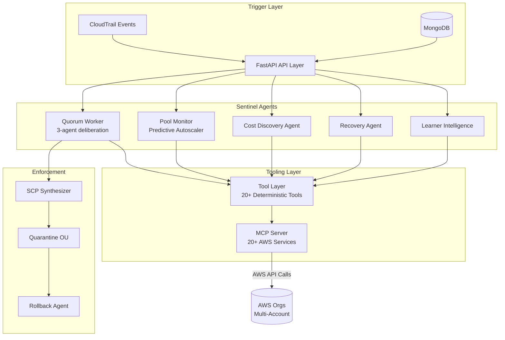
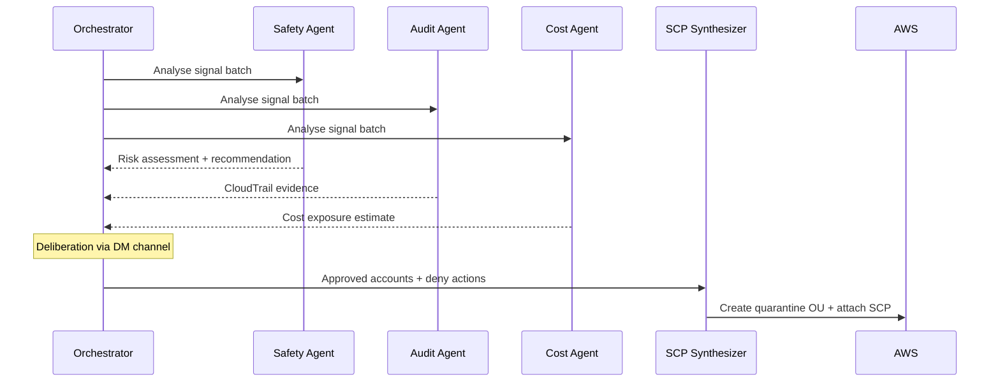

# AI Sentinel Ecosystem

An autonomous multi-agent system governing AWS lab account lifecycle, cost enforcement, security compliance, and learner intelligence across multi-organisation environments.

> Built as part of my engineering role at KodeKloud. Full implementation is proprietary — this repository documents the architecture, design decisions, and evaluation methodology.

---

## Overview

The sentinel ecosystem is a suite of 5 autonomous AI agents that replace manual AWS account governance. Each agent handles a distinct domain — from detecting abuse and enforcing cost controls, to intelligently recovering orphaned accounts and understanding learner behaviour patterns.

All agents are built on the **Claude Code Agent SDK**, run as Dockerised workers, and integrate into an existing FastAPI + MongoDB backend with a Vue 3 admin dashboard.

---

## System Architecture

---

## Agents

### 1. Quorum Governance Agent
A 3-agent deliberative system (Safety, Audit, Cost agents) that reaches consensus before applying any org-level enforcement action.

**Design rationale:** No single agent can quarantine an account unilaterally. All three must agree — or the request is dismissed. This prevents false positives from triggering irreversible actions.

**Key design decisions:**
- Quarantine OU approach (not shared policy modification) — zero blast radius on source OU accounts
- SCPs generated with alphanumeric-only SIDs to satisfy AWS policy constraints
- Rollback is a first-class operation — every quarantine creates a rollback manifest
- 5-SCP-per-OU limit handled by copying only 3 base SCPs into the quarantine OU + 1 new sentinel SCP

---

### 2. Pool Monitor — Predictive Autoscaler
Manages the reserve pool of AWS lab accounts across multiple organisations, predicting demand and provisioning/deprovisioning donor accounts before shortages occur.

**Key design decisions:**
- EMA (Exponential Moving Average) velocity learning with configurable alpha — avoids reacting to single-session spikes
- Hour-of-day demand profiles learned over time and stored in MongoDB (`velocity_profiles_learned` collection)
- Anti-flap cooldown logic prevents oscillation between provision/deprovision cycles
- Donor health protection — accounts with active users are never reclaimed
- Multi-org support: separate OU mappings per organisation, auto-resolved from env config

**Validation:** 7 end-to-end scenarios — including post-peak scale-in, donor exhaustion, and concurrent org environments.

---

### 3. Cost Discovery Agent
Autonomously scans AWS accounts for out-of-scope and high-cost resources, applying policy-based enforcement.

**Enforcement model:**
- Resources outside the lab IAM policy → always deleted (out of scope, regardless of cost)
- Resources within policy but without a threshold rule → reported and priced only (no deletion)
- Resources exceeding configured thresholds → flagged for quorum review

**False-positive filtering — 6 layers:**
1. Creation-only prefix filter (LIST/GET events excluded)
2. Free-tier resource skip list
3. System-initiated action exclusion (service-linked roles, AWS-managed resources)
4. kk_labs_user prefix filter (legitimate lab user activity)
5. Policy allowlist cross-reference
6. CloudTrail event deduplication

**Validation:** 7 resource types — AppSync, ECS, SNS, Kinesis, CodeCommit, SSM, Glue — all PASS across 11 runs.

---

### 4. Account Recovery Agent
Recovers orphaned AWS accounts after lab sessions expire — deleting resources in dependency-aware order to avoid deletion failures.

**Key design decisions:**
- Deletion ordering is derived from resource dependency graph (e.g. NAT Gateway before Subnet before VPC)
- MCP server provides curated action lists per service — prevents unbounded API scanning
- System resources filtered at tool level (service-linked roles, default VPCs, AWS-managed SSM docs)

**Validation:** 10 evaluation scenarios, 25 runs — including nested VPC dependency chains. Zero data loss record.

---

### 5. Learner Intelligence Agent
See the companion repository: [learner-intelligence-pipeline](https://github.com/TanishkaMarrott/learner-intelligence-pipeline)

---

## MCP Server — AWS Resource Scanner

A custom MCP server providing structured AWS API access across 20+ services.

**Design:**
- Curated action lists per service (e.g. IAM: 5 actions, EC2: 12, RDS: 3) — avoids open-ended LIST operations that scan thousands of resources
- SAR (Service Action Registry) fallback for unknown services — capped at 15 results
- Session cache: one STS assume-role per (account, region) — not per API call
- `required_cli_flags` hints prevent known scan pitfalls (e.g. `--owners self` for EC2 AMIs, `Key=Owner,Values=Self` for SSM documents)

---

## Tooling Layer

20+ deterministic tools covering:

| Category | Tools |
|----------|-------|
| Signal ingestion | `get_abuse_signals`, `get_accounts_pending_quorum` |
| CloudTrail | `scan_cloudtrail_events`, `get_threshold_coverage` |
| SCP management | `synthesize_scp`, `create_quarantine_ou`, `rollback_quarantine` |
| Account scanning | `scan_account_resources`, `clean_orphaned_resources` |
| Pool management | `get_pool_health`, `provision_donor`, `deprovision_donor` |
| Cost analysis | `get_unmapped_creation_events`, `get_out_of_scope_activity` |

All tools are auditable — every action is logged to MongoDB with account ID, timestamp, tool name, and result.

---

## Tech Stack

| Layer | Technology |
|-------|-----------|
| Agent framework | Claude Code Agent SDK |
| Agent communication | Claude Code Teams (DM deliberation) |
| MCP server | Python (custom) |
| Backend | FastAPI + MongoDB |
| Frontend | Vue 3 + Vuetify + Firebase Auth |
| Infrastructure | Docker + GitLab CI/CD |
| AWS scope | IAM, Organizations, SCPs, OUs, EC2, ECS, Lambda, S3, EventBridge, CloudTrail, Kinesis, AppSync, SNS, Glue, SSM, CodeCommit |

---

## Evaluation Methodology

Each agent was validated against a fixed scenario suite before being considered complete:

- **Quorum Agent:** 6-account demo seed, full DM deliberation, SCP applied and rollback validated
- **Pool Monitor:** 7 scenarios including multi-org, EMA learning, anti-flap, donor exhaustion
- **Cost Discovery:** 7 resource types, verbatim production API summaries, 11 runs all PASS
- **Recovery Agent:** 10 scenarios, 25 runs, VPC dependency chains, zero data loss

Scenarios are run against real dev AWS accounts — no mocking.

---

## Abuse Detection Calibration

97 CloudTrail actions calibrated across all major AWS services (98.4% coverage):
- High-egress controls: NAT Gateway, EC2 data transfer, S3 GetObject bulk, API Gateway, Kinesis, CloudFront
- System noise exclusion: service-linked role creation, AWS-managed resource events
- Threshold tiers: warn / flag / quarantine based on action severity and volume

---

*Architecture and design by Tanishka Marrott. Implementation is proprietary to KodeKloud.*
